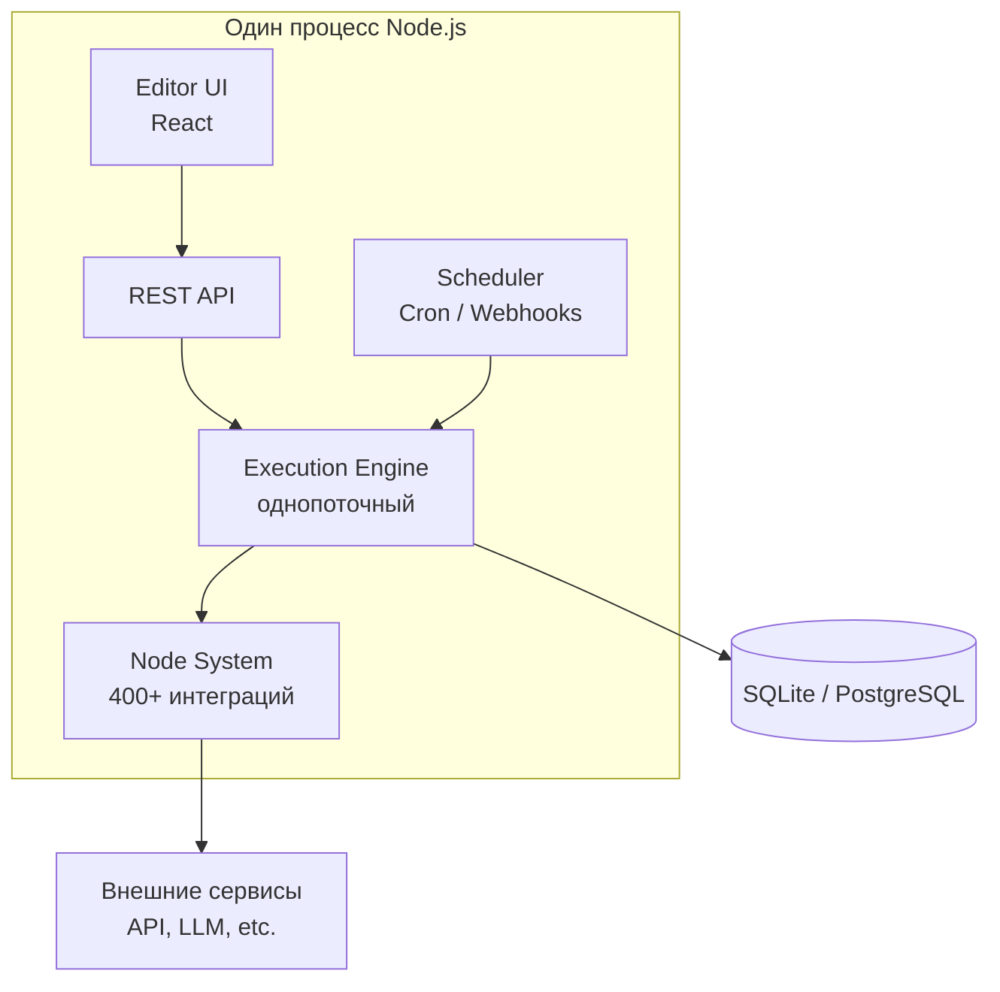
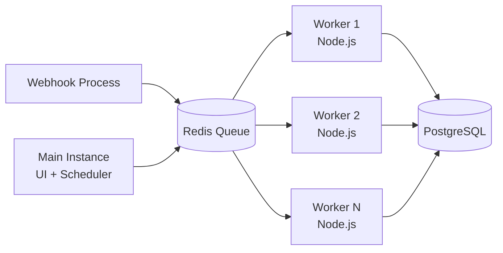
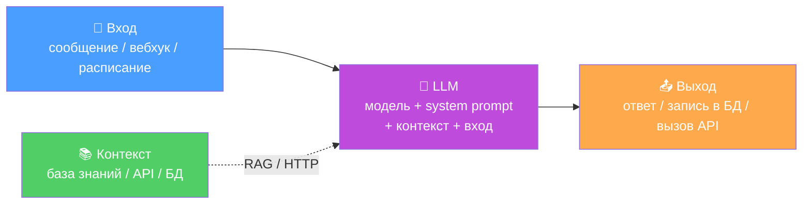
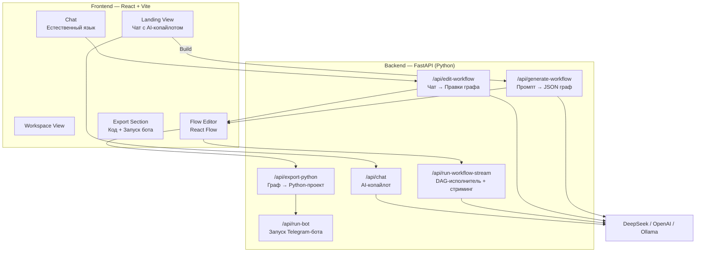
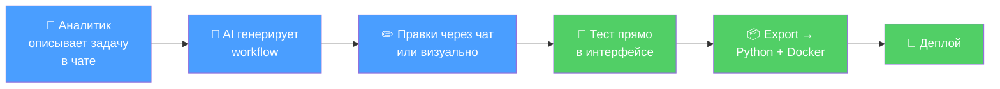
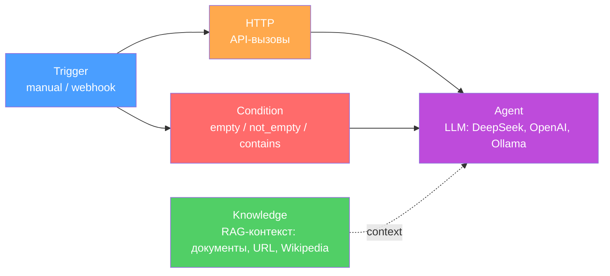

# Презентация: n9n Workflow Editor

---

## Блок 1: Что такое n8n и откуда он взялся

- **2019** — Jan Oberhauser (Берлин) создаёт n8n. Бывший VFX-артист, автоматизировал рутину на студиях → понял, что такой инструмент нужен всем.
- Название: **n8n = nodemation** (node + automation), по аналогии с k8s.
- Изначальная цель — **автоматизация рутинных действий** без кода: связать сервисы визуально (email → CRM → Slack и т.д.).
- Open-source, self-hosted — альтернатива Zapier/Make.

### Бум AI (2023–2025)

- Огромное комьюнити (147K+ звёзд GitHub, 200K+ пользователей).
- Появились **AI-ноды**: Agent Node, LangChain, поддержка OpenAI/Claude/Gemini/Groq, memory, multi-agent orchestration.
- Выручка выросла **в 5 раз** после AI-пивота.
- Series C — $180M, оценка **$2.5B**, среди инвесторов — NVIDIA.
- n8n стал де-факто стандартом для no-code AI-автоматизаций.

---

## Блок 2: Как n8n устроен внутри и почему не держит нагрузку

### Архитектура n8n (Single Mode)

### Проблемы

| Проблема | Детали |
|----------|--------|
| **Однопоточность** | Node.js single thread — тяжёлая нода блокирует весь event loop, включая UI |
| **Sequential execution** | Ноды выполняются последовательно, не параллельно — несмотря на визуальную схему |
| **Всё в одном процессе** | UI + scheduler + execution engine = память и CPU делятся между всеми |
| **31% failures** | 10 параллельных вебхуков в Single Mode → до 31% отказов |
| **Масштабирование сложно** | Нужен Queue Mode + Redis + отдельные воркеры + PostgreSQL + Kubernetes |

### Архитектура n8n (Queue Mode — для масштабирования)

Queue Mode решает проблемы, но это уже **отдельная инфраструктурная задача** — далеко от "no-code простоты".

---

## Блок 3: Пример — Т-Банк и «эмализация»

### Контекст

- **10 000+ IT-специалистов**, собственный AI-центр, модель T-lite, платформа Spirit.
- **«Эмализация»** — кампания по внедрению AI во все отделы: ускорение процессов, создание ассистентов и инструментов.
- Очень популярная задача — **создание нейроагента**. Часто за неё берутся начинающие специалисты-аналитики.

### Текущий пайплайн создания агента

```mermaid
flowchart LR
    A["👤 Аналитик<br/>получает задачу"] --> B["📖 Изучает документацию n8n<br/><i>долго</i>"]
    B --> C["🔧 Собирает агента<br/>из нод в n8n"]
    C --> D["🧪 Тестирует"]
    D --> E["✅ Агент работает"]
    E --> F["📈 Нагрузка растёт"]
    F --> G["⚠️ n8n не справляется"]
    G --> H["👨‍💻 Подключается разработчик"]
    H --> I["🔄 Переписывает<br/>агента в Python"]
    I --> J["🚀 Деплой сервиса"]

    style A fill:#4a9eff,color:#fff
    style F fill:#ff6b6b,color:#fff
    style G fill:#ff6b6b,color:#fff
    style H fill:#ffa94d,color:#fff
    style I fill:#ffa94d,color:#fff
    style J fill:#51cf66,color:#fff
```

**Итого: ~1 месяц**, два человека (аналитик + разработчик), куча ручной работы.

### Что идёт не так

1. Аналитик тратит время на документацию n8n вместо задачи
2. n8n не масштабируется без DevOps-усилий
3. Перенос из n8n в код — ручная работа, требует разработчика
4. Разработчик тратит время на разбор чужого workflow и переписывание

---

## Блок 3.5: Все агенты устроены одинаково

### Универсальная архитектура AI-агента

Неважно, что делает агент — саппорт-бот, HR-ассистент, аналитик данных, code-reviewer — внутри они устроены по одной схеме:

### Примеры — разные задачи, один скелет

| Агент | Вход | Контекст | System Prompt | Выход |
|-------|------|----------|---------------|-------|
| Саппорт-бот | Сообщение клиента | FAQ, документация | «Ты оператор поддержки, отвечай по базе знаний» | Ответ в чат |
| HR-ассистент | Вопрос сотрудника | Внутренние регламенты | «Ты HR-консультант, помогай по политикам компании» | Ответ в мессенджер |
| Аналитик данных | Запрос менеджера | Дашборды, SQL-база | «Ты data-аналитик, формируй отчёты» | Отчёт / график |
| Code-reviewer | Pull request | Стайлгайд, линтер | «Ты ревьюер, проверяй код по стандартам» | Комментарии к PR |

### Вывод

- Архитектура одинаковая → её можно **стандартизировать** в граф (trigger → knowledge/http → agent)
- Стандартная → можно **генерировать автоматически** по описанию задачи
- Стандартная → можно **конвертировать в код** по шаблону
- Мы не пытаемся покрыть всё — мы покрываем **90% реальных кейсов**, потому что они все построены одинаково

---

## Блок 4: Наше решение — n9n

### Архитектура n9n

### Пайплайн создания агента в n9n

**Итого: минуты–часы**, один человек, код генерируется автоматически.

### Типы нод

### Сравнение: n8n vs n9n

| | n8n | n9n (наш) |
|---|---|---|
| **Создание workflow** | Руками из нод + чтение документации | Описал задачу → AI сгенерировал |
| **Редактирование** | Drag & drop, настройка каждой ноды | Чат на естественном языке + визуальный редактор |
| **Масштабирование** | Queue Mode + Redis + K8s (отдельная задача) | Export → Python-сервис + Docker, деплой сразу |
| **Перенос в код** | Ручной, нужен разработчик | Автоматический (graph → Python) |
| **Сколько людей** | Аналитик + разработчик | Аналитик один |
| **Время** | ~1 месяц | Минуты–часы |
| **LLM-провайдеры** | Через ноды (OpenAI, etc.) | DeepSeek, OpenAI, Ollama — в ноде Agent |
| **Запуск бота** | Внешний деплой | Одной кнопкой из интерфейса |

---

## Блок 5: Что можно добавить в будущем

### Ближайшие улучшения

- **Больше типов нод**: database (SQL-запросы), transform (маппинг данных), loop (циклы), parallel (параллельное выполнение)
- **Визуальный дебаггер**: пошаговое выполнение workflow с отображением данных на каждом шаге
- **История версий**: откат workflow к предыдущим состояниям
- **Шаблоны workflow**: готовые шаблоны для частых задач (FAQ-бот, саппорт-агент, аналитик данных)

### Продвинутые фичи

- **Multi-agent orchestration**: несколько агентов в одном workflow, которые общаются между собой
- **RAG-пайплайн**: загрузка документов → chunking → vector store → retrieval в ноде Knowledge
- **Memory / контекст диалога**: агент помнит историю разговора (Redis / SQLite)
- **Мониторинг и аналитика**: дашборд с метриками работы агента (latency, token usage, ошибки)
- **Webhooks и schedule-триггеры**: автоматический запуск workflow по расписанию или по HTTP-запросу

### Инфраструктура и деплой

- **One-click deploy**: деплой на облачные платформы (Railway, Render, VPS) из интерфейса
- **CI/CD интеграция**: автоматический редеплой при обновлении workflow
- **Persistent storage**: PostgreSQL / SQLite вместо in-memory хранилища
- **Auth и multi-user**: авторизация, разделение workspace между пользователями

### Интеграции

- **MCP (Model Context Protocol)**: подключение внешних инструментов к агентам через стандартный протокол
- **Интеграция с корпоративными системами**: Jira, Confluence, Slack, 1С, Bitrix24
- **Поддержка российских LLM**: GigaChat (Сбер), YandexGPT, T-lite (Т-Банк)

---

## Итог: наша цель

Мы не решаем одну конкретную боль и не автоматизируем одну рутину.

Мы даём **полноценный инструмент**, с помощью которого можно автоматизировать **тысячи задач** — быстро и без боли встроить это в существующий IT-ландшафт предприятия любого размера.
